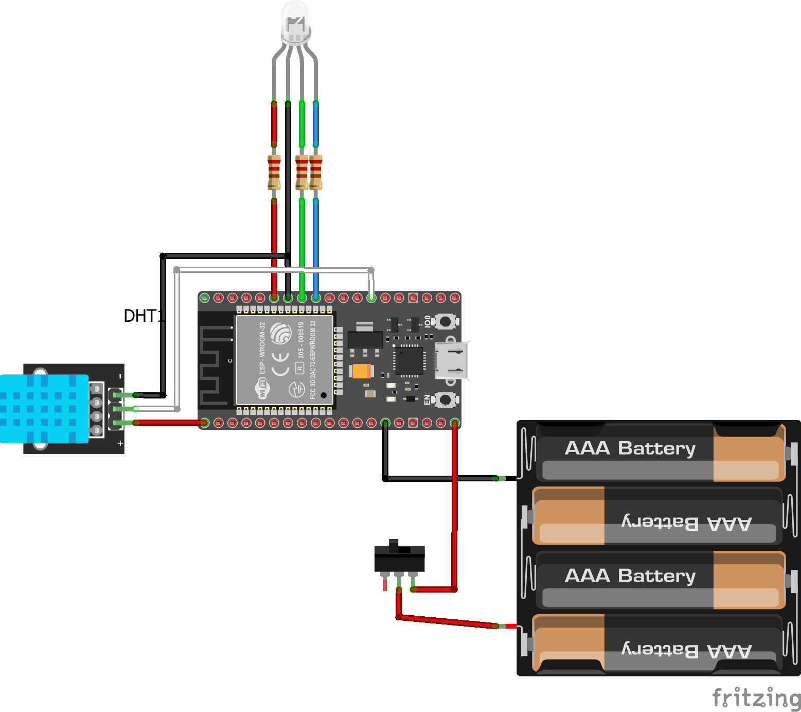

# Diagrama IoT 🗺️

A continuación se muestra un diagrama visual en el que podrá ver los componentes necesarios del módulo y sus conexiones. Es importante tener en cuenta que en cada placa `ESP32` los pines pueden estar en posiciones diferentes, por lo que recomiendo consultar la [guía de conexiones](./Connections.md) para poder usar el software.

