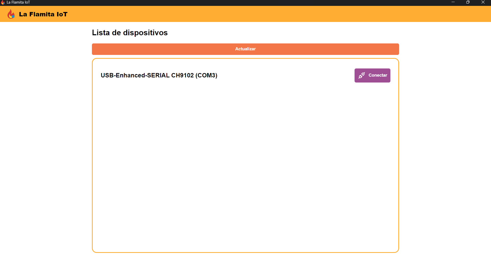
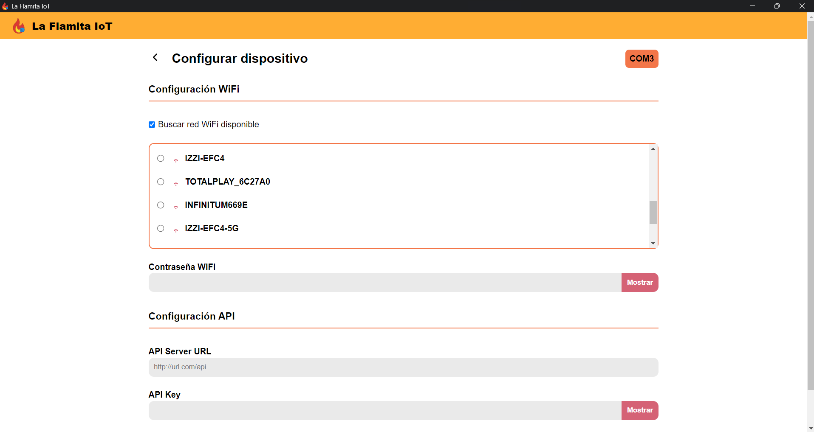
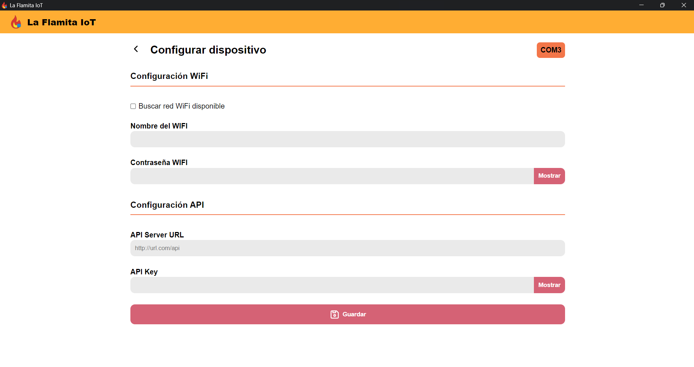

# Como usar el software de configuración 🕹️

Una vez descargado o compilado nuestro software es hora de utilizarlo, para ello es necesario que tengamos nuestro [módulo IoT](../arduino/Diagram.md) listo con el código cargado, consulta la guía para más información.

### Paso 1. Conectarse al sensor

Este paso es sencillo, pues únicamente necesitamos abrir nuestro programa y conectar nuestro módulo por USB a la computadora. Al conectar el sensor a la computadora debería encender un led de color `Rojo`, esto indica que necesita configurarse. Si el software reconoce el sensor sin problemas, entonces se mostrará una pantalla como la siguiente. El nombre puede ser diferente, pero que aparezca en la lista es suficiente.

En caso de que el software no detecte tu sensor, es probable que necesites algunos drivers específicos para ese modelo de `ESP32`, consulta la ficha técnica del proveedor.

### Paso 2. Iniciar el modo de configuración

Para iniciar el modo de configuración solo tenemos que pulsar el botón de `Conectar`, esto iniciara la comunicación con el sensor y debería encender el led de un color `Amarillo` o `Verde`, esto significa que el sensor entro en modo de configuración.

En caso de que el software arroje un mensaje de error con `El dispositivo no es compatible` puede significar un par de cosas:

1. Ya hay una conexión abierta con el sensor, por lo que es necesario desconectarlo y conectarlo nuevamente.
2. La placa no tiene cargado el código o se hizo incorrectamente. Se puede solucionar cargando el código nuevamente. 
3. La placa utilizada no es compatible con el código desarrollado.

En caso de tener el 3.er problema la única forma de solucionar el error es utilizar una placa compatible de la familia `ESP32`, los `Arduino UNO` no son compatibles.

Si se logró comenzar el modo de configuración exitosamente se mostrará la siguiente pantalla.

### Paso 3. Ingresar ajustes

Una vez en la pantalla de configuración se nos muestra algo de información, pues podemos visualizar en la esquina superior derecha el puerto en el cual está conectado nuestro sensor, en este caso el puerto `COM3`.

Aquí podemos configurar tanto la red WIFI de nuestro sensor como los ajustes de la `API`.

El primer `checkbox` nos permite elegir entre una de las redes WIFI encontradas por el software o ingresar manualmente el nombre.

En la `Configuración de API` tendremos que poner el URL de nuestro servidor de `la-flamita-web` y `API KEY` obtenido desde esa misma plataforma.

### Paso 4. Guardar la configuración

Una vez terminado de ingresar todos los ajustes tenemos que presionar el botón de `Guardar`, este enviara todos los ajustes aplicados al sensor mediante el puerto serial y terminara el modo de configuración.

Después de esto, el software cerrará el puerto de comunicación y volveremos a la pantalla inicial. En caso de que toda la configuración haya sido correcta, el led del sensor cambiara a color `Azul`, si este cambia a `Rojo` significa que algún campo de la configuración es incorrecto y tendremos que cambiarlo de nuevo. 

Es impórtate saber que los datos que pueden enviarse al sensor tienen unos ciertos requisitos, puedes consultarlos [aquí](./Requirements.md).